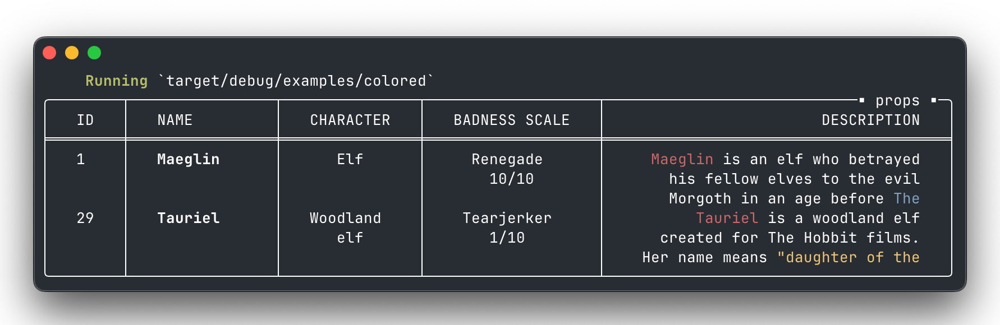

# Why Fancy Table?
The primary motivation behind this project was creating ASCII tables capable of displaying multi-line rows, particularly for content like JSON snippets. While numerous similar libraries exist, none properly handled this use case—which is what distinguishes Fancy Table from its competitors.

The project has evolved significantly, with several additional features implemented to create even more sophisticated tables:

- Optional table titles with left or right alignment
- Flexible column layouts supporting fixed, slim, or expandable widths
- Individual column alignment options (left, right, or center)
- Configurable column overflow behavior (text truncation or wrapping)
- Multiple character set styles: modern, classic, simple, or minimal
- Customizable headers with adjustable separators
- Optional row separators with full customization
- Adjustable padding settings
- Handling ANSI escape codes in table content

## Installation

``` toml
[dependencies]
fancy-table = "0.4.1"
```

## Usage
All crucial functionality exposed via simple, yet quite powerful API:

```rust
let table = FancyTable::create(FancyTableOpts {
        charset: Charset::Modern,
        ..Default::default()
})
.add_title_with_align("props", TitleAlign::RightOffset(1))
.add_column_named("ID", Layout::Slim)
.add_column_named("NAME", Layout::Fixed(16))
.add_column_named_wrapping_with_align("CHARACTER", Layout::Fixed(15), Align::Center)
.add_column_named_with_align("BADNESS SCALE", Layout::Expandable(15), Align::Center)
.add_column_named_wrapping_with_align("DESCRIPTION", Layout::Expandable(150), Align::Right)
.hseparator(Some(Separator::Double))
.padding(3)
.width(102)
.build();

table.render(vec![
   [
        "1",
        "\x1b[1mMaeglin\x1b[0m",
        "Elf",
        "Renegade\n10/10",
        "\x1b[31mMaeglin\x1b[0m is an elf who betrayed his fellow elves to the evil Morgoth in an age before \x1b[34mThe Lord of the Rings\x1b[0m.",
    ],
    [
        "29",
        "\x1b[1mTauriel\x1b[0m",
        "Woodland elf",
        "Tearjerker\n1/10",
        "\x1b[31mTauriel\x1b[0m is a woodland elf created for The Hobbit films. Her name means \x1b[33m\"daughter of the forest\"\x1b[0m in Sindarin.",
    ],
]);

```

results in fancy looking table with title and headers:



Fanciness disclaimer: depending on your terminal font quality of final result may range from unreadable piece of sh*t to beautiful looking table :)

To get some more idea how tables may look like, have a look at examples:

```sh
# available examples: colored, modern, classic, simple, minimal
cargo run --example modern
```
